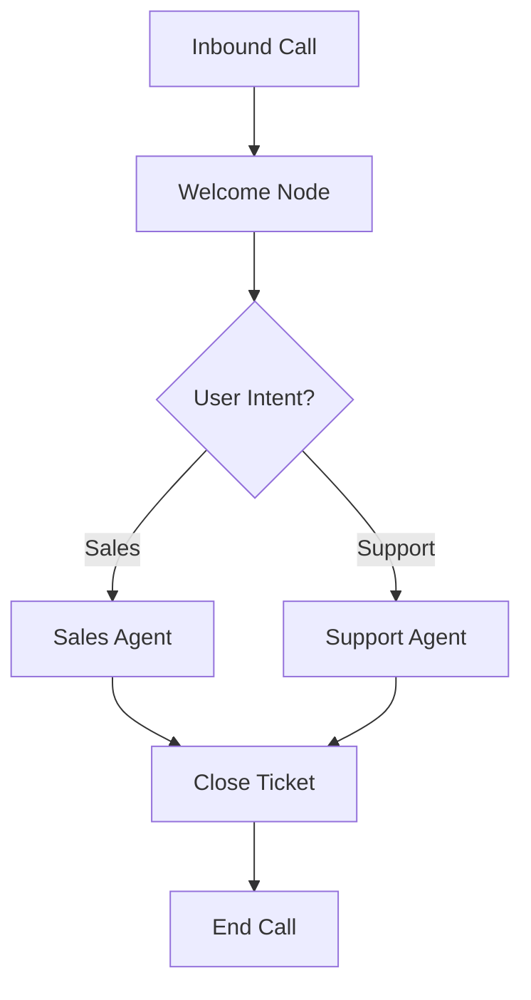

In Atoms, an "agent" is not a single monolithic entity but a **directed acyclic graph (DAG)** of **Nodes**. This graph structure allows you to decompose complex conversational logic into smaller, manageable, and reusable components.

<Info>
  **Conceptual Model**
  Think of the Graph as the map of your conversation. **Nodes** are the destinations (logic) and **Edges** are the roads (transitions). The session navigates this map based on events.
</Info>

## Key Properties

<CardGroup cols={3}>
  <Card title="Directed Flow" icon="arrow-right">
    Events and control move in a specific direction through the graph.
  </Card>
  <Card title="Event Highway" icon="truck-fast">
    The graph serves as the propagation channel for all system and user events.
  </Card>
  <Card title="Platform Managed" icon="seedling">
    The framework handles entry points, traversal, and lifecycle management automatically.
  </Card>
</CardGroup>

<Warning>
  **No Cycles Allowed**
  While you can revisit nodes logically, your graph structure must not contain infinite recursive cycles. The system enforces a DAG structure to prevent execution traps.
</Warning>

## Event Propagation

When a node emits an event (like a user message or a tool output), it travels through the graph:
1.  Nodes **receive** events from the system or upstream nodes.
2.  Nodes **process** these events.
3.  Nodes **emit** new events to downstream nodes or back to the system.

## Visualizing the Graph

By organizing your agent as a graph, you gain:
*   **Modularity**: Update the "Sales Agent" without breaking the "Support Agent".
*   **Observability**: Trace exactly which path a conversation took.
*   **Control**: Fine-tune the logic at every step of the flow.
