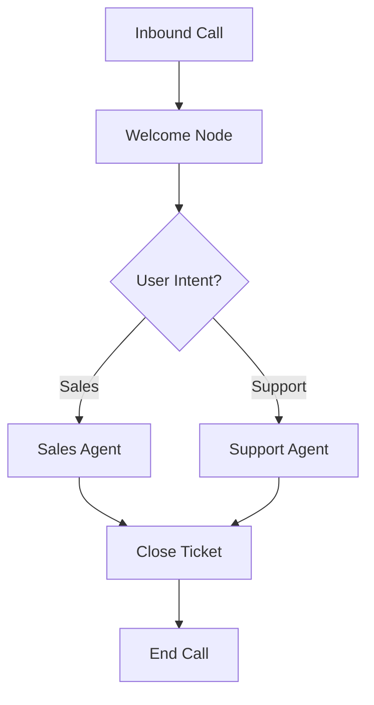

In Atoms, an "agent" is not a single monolithic entity but a **directed acyclic graph (DAG)** of **Nodes**. This graph structure allows you to decompose complex conversational logic into smaller, manageable, and reusable components.

## Conceptual Model

Think of the Graph as the map of your conversation.

*   **Nodes**: The destinations. Each node represents a specific unit of logic or behavior (e.g., "Welcome User", "Collect Payment", "Process Order").
*   **Edges**: The roads. They define the possible transitions between nodes.

When the system runs, the `AgentSession` navigates this graph, moving from node to node based on events and the logic defined within each node.

## Key Properties

### 1. Directed & Acyclic
The flow of events and control moves in a specific direction. While you can loop back to previous logical states by revisiting nodes, the structural definition should prevent infinite recursive cycles that trap the execution flow.

### 2. Event Propagation
The graph is the highway for **events**. When a node emits an event (like a user message or a tool output), it travels through the graph.
*   Nodes **receive** events from the system or upstream nodes.
*   Nodes **process** these events.
*   Nodes **emit** new events to downstream nodes or back to the system.

### 3. Abstraction
You don't need to worry about defining a "root" or "leaf" node explicitly. The Atoms framework handles the entry point and traversal mechanics. You simply define your nodes and how they connect to each other.

## Visualizing the Graph

By organizing your agent as a graph, you gain:
*   **Modularity**: Update the "Sales Agent" without breaking the "Support Agent".
*   **Observability**: Trace exactly which path a conversation took.
*   **Control**: Fine-tune the logic at every step of the flow.
