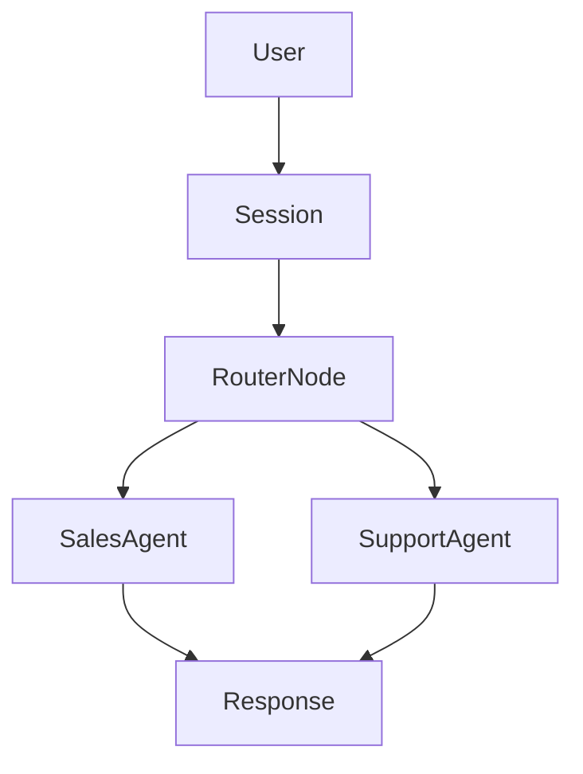

Atoms SDK enables developers to build conversational AI systems by composing specialized agents in a graph structure. Beyond building agents, the SDK also provides a robust **Platform API** to programmatically manage your agents, campaigns, and observability.

<CardGroup cols={2}>
  <Card title="Fine-grained Control" icon="sliders">
    Manage agent behavior, routing, and tool execution with precision.
  </Card>
  <Card title="Low Latency" icon="bolt">
    Built for streaming environments like telephony and real-time web calls.
  </Card>
  <Card title="Graph-based" icon="circle-nodes">
    Compose agents into directed graphs for complex workflows.
  </Card>
  <Card title="Code-first" icon="code">
    Keep reasoning logic in code while offloading orchestration.
  </Card>
</CardGroup>

## Designed for Scale

Atoms is built for teams that need to go beyond simple chatbots. Whether you are building valid customer support agents, sales bots, or complex internal tools, Atoms provides the primitives you need.

### Key Capabilities
- **Event-driven**: Everything is an event, from user messages to internal signals.
- **Stateful Nodes**: Maintain context across long-running sessions.
- **Flexible Routing**: Direct traffic between agents dynamically.

## Architecture

At the high level, an Atoms application consists of a **Session** that manages a **Graph** of **Nodes**. Events flow through this graph, triggering **Agents** to generate responses or take actions.

