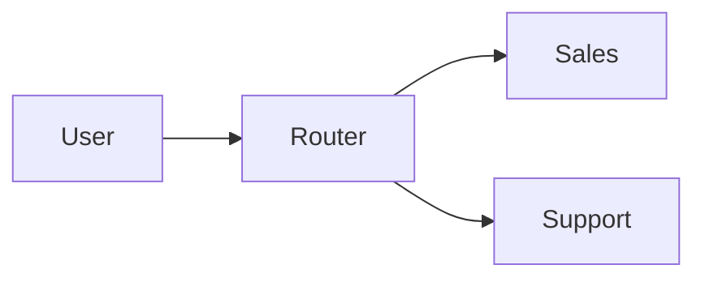

Connecting multiple agents allows for specialized handling of complex tasks.

## The Router Pattern

A common pattern is a "Router" node that decides which specialist agent should handle a request.



### Implementation Pseudocode

```python
class RouterNode(BaseNode):
    async def process_event(self, event):
        # 1. Analyze user intent (e.g., using a lightweight LLM or classifier)
        intent = analyze_intent(event.content)
        
        # 2. Add destination to metadata
        if intent == "sales":
            event.metadata["destination"] = "sales_agent"
        elif intent == "support":
            event.metadata["destination"] = "support_agent"
            
        # 3. Forward to all children (agents filter by destination)
        await self.send_event(event)

class SalesAgent(OutputAgentNode):
    async def process_event(self, event):
        # Only process if routed here
        if event.metadata.get("destination") == "sales_agent":
            await super().process_event(event)
```

## Handoff Pattern

An agent can explicit "hand off" the conversation to another agent.

```python
class TriageAgent(OutputAgentNode):
    async def generate_response(self):
        if "talk to human" in user_message:
            # Emit a specialized event to switch context
            await self.send_event(HandoffEvent(target="human_escalation"))
            return
            
        # Normal processing...
```
